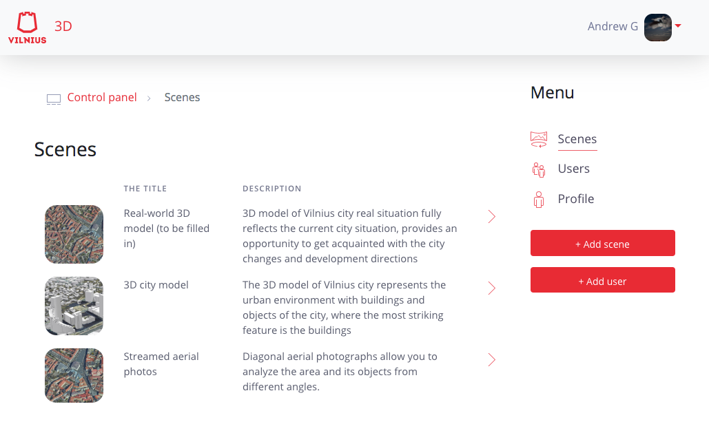

# Front end application
Public page

Authorized page

## Development server

Run `ng serve -o` for a dev server. Default port set to 3000 (check backend app) `http://localhost:3000/`.

Back end REST services are neccessary, 4200 port consumed. Check environment file. Check backend catalog

## Build

Run `ng build` to build the project. The build artifacts will be stored in the `dist/` directory. Use the `--prod` flag for a production build.

## Running Vilnius 3D unit tests

Run `ng test` to execute the unit tests via [Karma](https://karma-runner.github.io).

## Running end-to-end tests. TODO add tests

Run `ng e2e` to execute the end-to-end tests via [Protractor](http://www.protractortest.org/).

## TODO
Switch from storage in localstorage